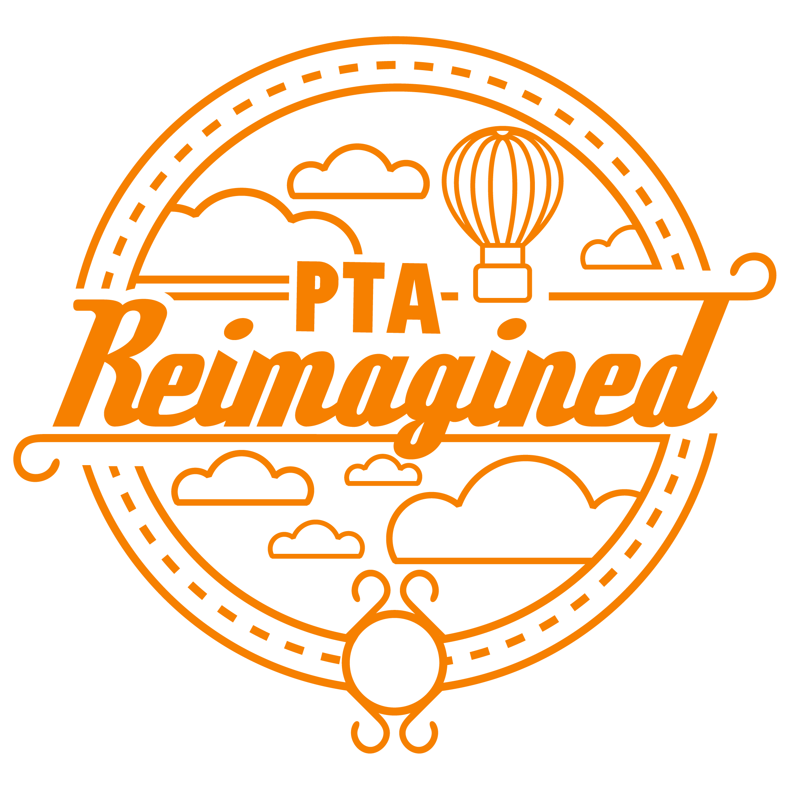

+++
title = "PTA Reimagined"
date = 2019-11-27

[taxonomies]
skills = ["Logo Design","Graphic design","Adobe Illustrator"]

[extra]
projectLink = "https://dribbble.com/shots/26146327-PTA-Reimagined?utm_source=Clipboard_Shot&utm_campaign=GingerEdition&utm_content=PTA%20Reimagined&utm_medium=Social_Share&utm_source=Clipboard_Shot&utm_campaign=GingerEdition&utm_content=PTA%20Reimagined&utm_medium=Social_Share"
+++

\
A logo and brand designed for the local PTAs to use with their year's theme of "PTA Reimagined"

<!--more-->
